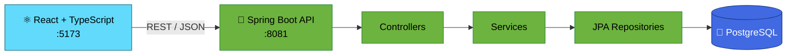
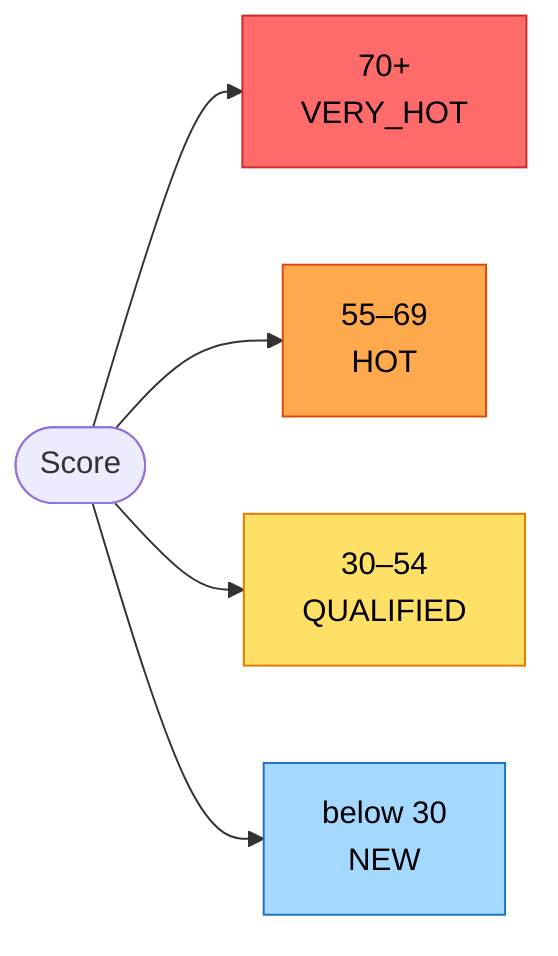

<h1 align="center">🛍️ RetailMax CRM</h1>

<p align="center">
  A full-stack CRM for retail teams to manage customers, leads, deals, tasks and campaigns in one place.
</p>

<p align="center">
  
  
  
  
  
  
  
</p>

---

## 📌 Overview

RetailMax CRM keeps a retail sales team's daily work together: who the customers are, which leads are promising, which deals are in progress, and what needs follow-up. A React interface talks to a Spring Boot REST API, which stores everything in PostgreSQL.

## ✨ Features

- 🔐 **Authentication:** register and log in
- 👥 **Customers:** add, edit, search and delete
- 🎯 **Leads:** track by source and status, score them, and convert them into customers
- 💼 **Deals:** track amount and stage, with probability set from the stage
- ✅ **Tasks:** calls, emails and meetings with priority, due date and completion
- 📣 **Campaigns:** budget, lead targets and revenue, with activate and pause
- 🔔 **Notifications:** type, priority and read or unread state
- 🧑‍💼 **Users & Settings:** manage accounts, roles and status
- 🎨 **Interface:** light and dark mode, plus an optional cursor trail

## 🏗️ How it works



## 🎯 Lead scoring

A lead earns points for contact details and source, up to a maximum of **80**:

- Email **+20**, phone **+20**, first and last name **+10**
- Source: Referral **+30**, LinkedIn **+25**, Website **+20**, Social Media **+15**, other **+10**



Converting a lead creates a customer from its name, email and phone, and marks the lead `CONVERTED`.

## 🚀 Getting started

**You need:** Java 21, Node.js and npm, and PostgreSQL.

```bash
git clone https://github.com/Ananyaaa171/RetailMax-CRM.git
cd RetailMax-CRM
```

**1. Create the database**

```sql
CREATE DATABASE retailmax;
```

Tables are created automatically on first run.

**2. Run the backend** (http://localhost:8081)

Set your own PostgreSQL credentials in `backend/retailmax-backend/src/main/resources/application.properties`, or use environment variables:

```env
SPRING_DATASOURCE_USERNAME=your_username
SPRING_DATASOURCE_PASSWORD=your_password
```

```bash
cd backend/retailmax-backend
./mvnw spring-boot:run        # Windows: mvnw.cmd spring-boot:run
```

**3. Run the frontend** (http://localhost:5173)

```bash
cd frontend
npm install
npm run dev
```

Register an account on the login screen, then sign in.

## 🔌 API

All endpoints start with `/api`: `auth`, `dashboard`, `customers`, `leads`, `deals`, `tasks`, `campaigns`, `notifications` and `users`. Most support the usual create, read, update and delete calls. Leads also have `POST /api/leads/{id}/calculate-score` and `POST /api/leads/{id}/convert`.

## ⚠️ Current limitations

- Endpoints are not protected, and roles are stored but not enforced.
- The dashboard shows sample figures rather than live data.
- The support form only shows an on-screen confirmation and does not send anything.
- The login screen and the Users page use separate user tables.
- The Deal form offers some stages the backend rejects (`QUALIFIED`, `WON`, `LOST`).
- The API URL is hardcoded to `localhost:8081`.
- Testing is limited to one context-load test, and there is no deployment setup.

## 🔭 Future scope

Token-based authentication, role-based access control, a live dashboard, aligned deal stages, input validation, more automated tests, and cloud deployment.

## 👩‍💻 Author

**Ananya Sharma**

## 📄 License

No license has been specified yet.
