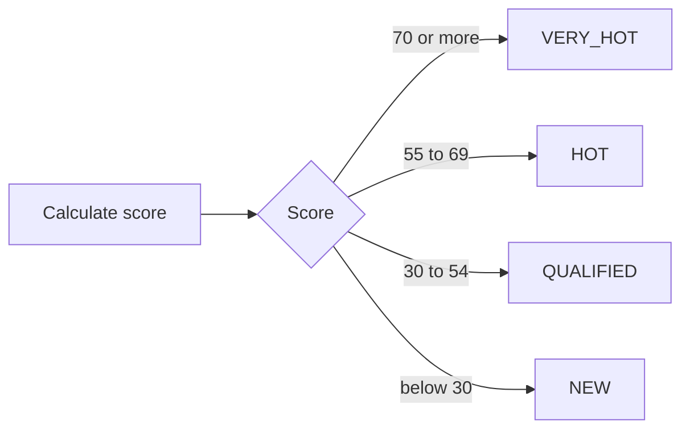
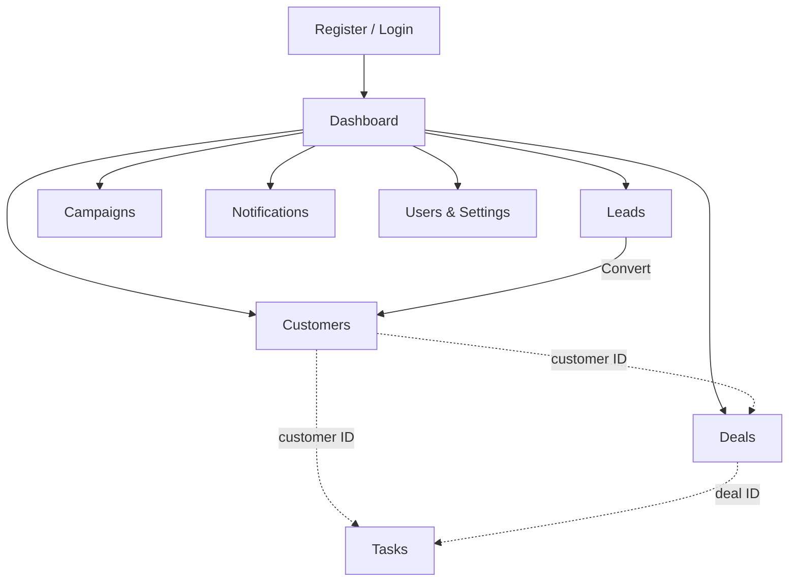
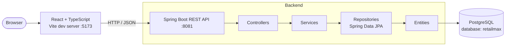
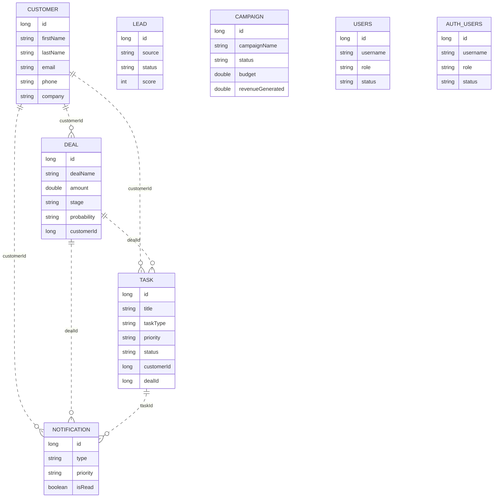
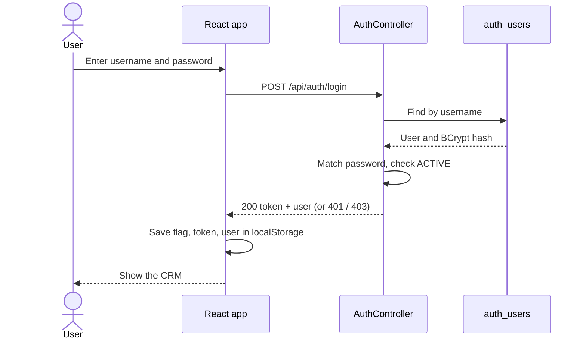

# RetailMax CRM

A full-stack customer relationship management web application for retail operations, built with React, Spring Boot and PostgreSQL.

---

## Table of Contents

1. [Project Overview](#project-overview)
2. [Key Features](#key-features)
3. [Module Breakdown](#module-breakdown)
4. [Lead Scoring](#lead-scoring)
5. [System Workflow](#system-workflow)
6. [System Architecture](#system-architecture)
7. [Technology Stack](#technology-stack)
8. [Project Structure](#project-structure)
9. [Database](#database)
10. [REST API](#rest-api)
11. [Authentication & Security](#authentication--security)
12. [Frontend](#frontend)
13. [Backend](#backend)
14. [Installation & Setup](#installation--setup)
15. [Screens](#screens)
16. [Testing](#testing)
17. [Error Handling & Validation](#error-handling--validation)
18. [Deployment](#deployment)
19. [Known Limitations](#known-limitations)
20. [Future Scope](#future-scope)
21. [Project Status](#project-status)
22. [Academic Context](#academic-context)
23. [Author](#author)
24. [License](#license)

---

## Project Overview

RetailMax CRM is a web application for managing the day-to-day sales and customer activity of a retail business. It keeps customers, leads, deals, tasks, marketing campaigns and notifications in one place instead of spread across separate tools or spreadsheets.

It is intended for small sales and marketing teams. The application is built around a single "RetailMax CRM" workspace with Indian locale conventions (₹ currency formatting and `en-IN` date display).

**Objective:** to implement a complete CRM workflow end to end, from a React interface through a REST API to a relational database, including a rule-based lead scoring feature.

---

## Key Features

- Account registration and login (BCrypt-hashed passwords)
- Create, edit, search and delete **customers**
- Track **leads** by source and status, calculate a lead score, and convert a lead into a customer
- Manage **deals** by stage with stage-driven probability
- Manage **tasks** (call, email, meeting and others) with priority, status and completion
- Manage **campaigns** with budget, lead targets and revenue, and activate or pause them
- Create **notifications** with type and priority, and mark them read or unread
- Manage **user accounts** with roles and status, filterable by role and status
- Light and dark themes (remembered in the browser) and an optional cursor trail
- Backend reporting endpoints for dashboard totals, sales and lead breakdowns

See [Known Limitations](#known-limitations) for features that are only partly wired up.

---

## Module Breakdown

| Module | Purpose | Main Functionalities |
|---|---|---|
| Authentication | Create accounts and sign in | Register with validation, login, inactive-account check |
| Dashboard | Overview page | Summary cards and a sales pipeline view (**static sample data in the current frontend**) |
| Customers | Customer records | Add, edit, delete, search; cards for total, companies, with phone, with email |
| Leads | Sales prospects | Add, edit, delete, search; source and status; **Score** and **Convert** actions |
| Deals | Sales opportunities | Add, edit, delete, search; customer ID, amount, stage, probability, expected close date |
| Tasks | Follow-up activities | Add, edit, delete, search; type, due date, priority, status; **Complete** action |
| Campaigns | Marketing campaigns | Add, edit, delete, search; type, audience, dates, budget, leads, revenue; **Activate** / **Pause** |
| Notifications | Alerts | Create, delete, search; type, priority, optional customer/deal/task link; mark read / unread |
| Users & Settings | Accounts and workspace info | User list with search, role and status filters; add, edit, deactivate, delete; Workspace and Preferences panels |
| Support | Help request form | Contact panel and request form on the dashboard (**front-end only, does not send data**) |

---

## Lead Scoring

Implemented in `LeadService.calculateLeadScore()` and exposed as `POST /api/leads/{id}/calculate-score`. The Leads screen calls it from the **Score** button.

| Factor | Points |
|---|---|
| Email present | 20 |
| Phone present | 20 |
| Source: Referral | 30 |
| Source: LinkedIn | 25 |
| Source: Website | 20 |
| Source: Social Media | 15 |
| Any other non-blank source | 10 |
| First name and last name both present | 10 |

The maximum achievable score is **80** (the code also caps scores at 100). Source matching is case-insensitive.

The score then sets the lead status:



**Conversion** (`POST /api/leads/{id}/convert`) creates a new customer from the lead's first name, last name, email and phone, then sets the lead's status to `CONVERTED`. The company field is not copied, and the code does not check whether a lead was already converted.

---

## System Workflow



1. A user registers, then logs in.
2. The app opens on the Dashboard. The top navigation switches between the eight modules.
3. Leads are scored and converted into customers.
4. Deals and tasks can reference a customer (and tasks a deal) by ID.
5. Campaigns track budget, lead targets and revenue.
6. Notifications and user accounts are managed from their own pages.

---

## System Architecture



| Layer | Responsibility |
|---|---|
| Frontend | Renders the UI, holds page state, validates the login form and calls the API with `fetch` |
| Controllers | Define `/api/...` endpoints, accept and return JSON, set HTTP status codes |
| Services | Business logic: default values, stage rules, lead scoring, report calculations |
| Repositories | Spring Data JPA interfaces for database access, including a few derived queries |
| Entities | JPA classes mapped to PostgreSQL tables |
| Database | PostgreSQL; tables are created or updated by Hibernate on startup |

Most controllers call a service. `AuthController` talks to its repository directly.

---

## Technology Stack

| Layer | Technology | Version | Purpose |
|---|---|---|---|
| Frontend | React | ^19.2.8 | User interface |
| Language | TypeScript | ~6.0.2 | Typed frontend code |
| Build tool | Vite | ^8.3.0 | Dev server and production build |
| Linting | Oxlint | ^1.81.0 | Frontend linting |
| Backend | Java | 21 | Backend language |
| Framework | Spring Boot | 4.1.1 | REST API (Spring Web MVC) |
| ORM | Spring Data JPA / Hibernate | via Spring Boot | Database access |
| Database | PostgreSQL | not pinned | Persistent storage |
| Password hashing | Spring Security Crypto (BCrypt) | via Spring Boot | Hashing for registered accounts |
| Utilities | Lombok, Spring Boot DevTools | via Spring Boot | Boilerplate reduction, dev restarts |
| Build | Maven (wrapper included) | - | Backend build |

The Spring Boot Validation starter is on the classpath but no validation annotations are used.

---

## Project Structure

```text
RetailMax-CRM/
├── backend/
│   └── retailmax-backend/
│       ├── pom.xml
│       ├── mvnw / mvnw.cmd
│       └── src/
│           ├── main/
│           │   ├── java/retailmax_backend/
│           │   │   ├── RetailmaxBackendApplication.java
│           │   │   ├── controller/    # REST endpoints (one per module)
│           │   │   ├── service/       # Business logic
│           │   │   ├── repository/    # Spring Data JPA repositories
│           │   │   └── entity/        # JPA entities
│           │   └── resources/
│           │       └── application.properties
│           └── test/java/retailmax_backend/
│               └── RetailmaxBackendApplicationTests.java
│
├── frontend/
│   ├── package.json
│   ├── vite.config.ts
│   └── src/
│       ├── main.tsx                   # Entry point and login gate
│       ├── App.tsx                    # App shell and all CRM pages
│       ├── App.css                    # Application styles (light and dark)
│       └── components/
│           ├── AuthPage.tsx           # Login and register screen
│           └── AuthPage.css
│
└── .gitignore
```

---

## Database

- **Database:** PostgreSQL, database name `retailmax`, on `localhost:5432` by default
- **Schema management:** `spring.jpa.hibernate.ddl-auto=update`, so Hibernate creates and updates tables on startup
- **SQL logging:** enabled (`spring.jpa.show-sql=true`)

| Table | Entity | Important fields |
|---|---|---|
| `customers` | Customer | firstName, lastName, email, phone, company |
| `leads` | Lead | firstName, lastName, email, phone, source, status, score |
| `deals` | Deal | dealName, amount, stage, probability, expectedCloseDate, customerId |
| `tasks` | Task | title, description, taskType, status, priority, dueDate, customerId, dealId |
| `campaigns` | Campaign | campaignName, campaignType, status, targetAudience, startDate, endDate, budget, targetLeads, generatedLeads, convertedLeads, revenueGenerated |
| `notifications` | Notification | title, message, type, priority, isRead, customerId, dealId, taskId |
| `users` | UserAccount | username, email, password, fullName, role, status |
| `auth_users` | AuthUser | username, email, fullName, password, role, status |

Most tables also store `createdAt` and `updatedAt`, set by JPA lifecycle callbacks.

**Relationships.** There are no JPA relationship annotations and no database foreign keys. `customerId`, `dealId` and `taskId` are plain `Long` columns that act as logical references.



Leads, campaigns and the two user tables are standalone. Converting a lead creates a customer but stores no link between them.

---

## REST API

All endpoints use the `/api` prefix. The backend runs on port `8081`. Request and response bodies are JSON.

### Authentication

| Method | Endpoint | Description |
|---|---|---|
| POST | `/api/auth/register` | Create an account (stored in `auth_users`) |
| POST | `/api/auth/login` | Log in; returns a token and the user |

### Dashboard

| Method | Endpoint | Description |
|---|---|---|
| GET | `/api/dashboard/summary` | Totals for customers, leads, deals, pipeline value, tasks, campaigns and notifications |
| GET | `/api/dashboard/sales` | Deal totals, won/lost counts and values, win rate |
| GET | `/api/dashboard/leads` | Lead total and count per status |

### Customers

| Method | Endpoint | Description |
|---|---|---|
| GET | `/api/customers` | List customers |
| GET | `/api/customers/{id}` | Get one customer |
| POST | `/api/customers` | Create a customer |
| PUT | `/api/customers/{id}` | Update a customer |
| DELETE | `/api/customers/{id}` | Delete a customer |

### Leads

| Method | Endpoint | Description |
|---|---|---|
| GET | `/api/leads` | List leads |
| GET | `/api/leads/{id}` | Get one lead |
| POST | `/api/leads` | Create a lead (score defaults to 0, status to `NEW`) |
| PUT | `/api/leads/{id}` | Update a lead |
| DELETE | `/api/leads/{id}` | Delete a lead |
| POST | `/api/leads/{id}/calculate-score` | Calculate score and update status |
| POST | `/api/leads/{id}/convert` | Convert the lead into a customer |

### Deals

| Method | Endpoint | Description |
|---|---|---|
| GET | `/api/deals` | List deals |
| GET | `/api/deals/{id}` | Get one deal |
| POST | `/api/deals` | Create a deal |
| PUT | `/api/deals/{id}` | Update a deal |
| DELETE | `/api/deals/{id}` | Delete a deal |

### Tasks

| Method | Endpoint | Description |
|---|---|---|
| GET | `/api/tasks` | List tasks |
| GET | `/api/tasks/{id}` | Get one task |
| GET | `/api/tasks/customer/{customerId}` | Tasks for a customer |
| GET | `/api/tasks/deal/{dealId}` | Tasks for a deal |
| GET | `/api/tasks/status/{status}` | Tasks by status |
| GET | `/api/tasks/priority/{priority}` | Tasks by priority |
| POST | `/api/tasks` | Create a task |
| PUT | `/api/tasks/{id}` | Update a task |
| PUT | `/api/tasks/{id}/complete` | Mark a task `COMPLETED` |
| DELETE | `/api/tasks/{id}` | Delete a task |

### Campaigns

| Method | Endpoint | Description |
|---|---|---|
| GET | `/api/campaigns` | List campaigns |
| GET | `/api/campaigns/{id}` | Get one campaign |
| GET | `/api/campaigns/status/{status}` | Campaigns by status |
| GET | `/api/campaigns/type/{campaignType}` | Campaigns by type |
| GET | `/api/campaigns/audience/{audience}` | Search by target audience |
| POST | `/api/campaigns` | Create a campaign |
| PUT | `/api/campaigns/{id}` | Update a campaign |
| PUT | `/api/campaigns/{id}/status?status=` | Change campaign status |
| PUT | `/api/campaigns/{id}/performance` | Update `generatedLeads`, `convertedLeads`, `revenueGenerated` (query parameters) |
| GET | `/api/campaigns/{id}/performance` | Lead achievement %, conversion rate %, budget, revenue, ROI % |
| DELETE | `/api/campaigns/{id}` | Delete a campaign |

### Notifications

| Method | Endpoint | Description |
|---|---|---|
| GET | `/api/notifications` | List notifications |
| GET | `/api/notifications/{id}` | Get one notification |
| GET | `/api/notifications/unread` | Unread notifications, newest first |
| GET | `/api/notifications/type/{type}` | Notifications by type |
| GET | `/api/notifications/priority/{priority}` | Notifications by priority |
| POST | `/api/notifications` | Create a notification |
| PUT | `/api/notifications/{id}/read` | Mark as read |
| PUT | `/api/notifications/{id}/unread` | Mark as unread |
| DELETE | `/api/notifications/{id}` | Delete a notification |

### Users

| Method | Endpoint | Description |
|---|---|---|
| GET | `/api/users` | List user accounts |
| GET | `/api/users/{id}` | Get one user |
| GET | `/api/users/role/{role}` | Users by role |
| GET | `/api/users/status/{status}` | Users by status |
| POST | `/api/users` | Create a user |
| POST | `/api/users/login` | Log in against the `users` table (not used by the frontend) |
| PUT | `/api/users/{id}` | Update a user |
| PUT | `/api/users/{id}/status?status=` | Change user status |
| DELETE | `/api/users/{id}` | Delete a user |

### Examples

Request bodies follow the entity fields.

**Register**

```http
POST /api/auth/register
Content-Type: application/json

{
  "username": "ananya",
  "email": "ananya@example.com",
  "fullName": "Ananya Sharma",
  "password": "secret123"
}
```

```json
{ "message": "Account created successfully." }
```

**Login**

```http
POST /api/auth/login
Content-Type: application/json

{ "username": "ananya", "password": "secret123" }
```

```json
{
  "token": "<random UUID>",
  "user": {
    "id": 1,
    "username": "ananya",
    "email": "ananya@example.com",
    "fullName": "Ananya Sharma",
    "role": "SALES_USER"
  }
}
```

**Create a customer**

```http
POST /api/customers
Content-Type: application/json

{
  "firstName": "Rahul",
  "lastName": "Verma",
  "email": "rahul@example.com",
  "phone": "9876543211",
  "company": "ABC Retail"
}
```

**Change campaign status**

```http
PUT /api/campaigns/2/status?status=PAUSED
```

---

## Authentication & Security

| Aspect | Implementation |
|---|---|
| Registration | `POST /api/auth/register`. Requires username, email, full name and password. Password must be at least 6 characters, email must match a basic pattern, and username and email must be unique (HTTP 409 if taken). New accounts get role `SALES_USER` and status `ACTIVE`. |
| Login | `POST /api/auth/login`. Returns 401 for a wrong username or password and 403 for an inactive account. |
| Password hashing (login accounts) | BCrypt, in `AuthController`. |
| Password hashing (Users module) | Accounts created in **Users & Settings** are stored in the separate `users` table and hashed with **unsalted SHA-256** (prefixed `HASHED:`) by the entity. |
| Token | Login returns a random UUID. It is **not stored or validated by the server**. |
| Frontend session | After login the frontend stores `retailmax-authenticated`, `retailmax-token` and `retailmax-user` in `localStorage`. Showing the app or the login screen depends only on the `retailmax-authenticated` flag. The token is never sent with API requests. |
| Roles | Stored on both user tables (the Users form offers `ADMIN`, `MANAGER`, `SALES_USER`). |
| Authorization | **Roles are not enforced.** No endpoint checks the caller's identity or role. |
| Protected endpoints | **None.** All `/api` endpoints can be called without credentials. |
| Password exposure | `UserAccount.password` is write-only in JSON responses. |
| CORS | Configured per controller with `@CrossOrigin` for local origins (`localhost:5173`, `localhost:3000`, and `localhost:5174` on most controllers). |
| Logout | No logout control was found in the UI. |

> **Two separate user stores.** Registration and the login screen use `auth_users`. The Users & Settings page manages the `users` table. Accounts registered through the login screen do not appear in Users & Settings, and users created there cannot log in through the login screen.



---

## Frontend

- **Stack:** React 19, TypeScript, Vite
- **Entry:** `main.tsx` wraps the app in an auth gate. It shows `AuthPage` until the `localStorage` flag is set, then renders `App`.
- **Navigation:** state-based. `App.tsx` keeps an `activePage` value and switches between page components from a top navigation bar. There is no router and no per-page URL.
- **Pages:** `Dashboard`, `CustomersPage`, `LeadsPage`, `DealsPage`, `TasksPage`, `CampaignsPage`, `NotificationsPage`, `UsersSettingsPage`, all in `App.tsx`. `CustomerSupport` renders on the dashboard.
- **API calls:** a shared `apiRequest()` helper sends `fetch` requests to `http://localhost:8081` (hardcoded). The login screen uses the same base URL.
- **State:** React `useState` / `useEffect` per page. Each page loads its list on mount and reloads after create, update or delete.
- **Forms:** modal forms for add and edit.
- **Search and filters:** each list has a client-side search box. The Users list also has role and status filters.
- **Theme:** light and dark mode, toggled from the header and saved in `localStorage` (`retailmax-dark-mode`). The optional emerald cursor trail is drawn on a canvas and resets on reload.
- **Responsive CSS:** the stylesheets include media queries for narrow screens.
- **Feedback states:** loading text, per-page error messages, delete confirmation dialogs and a disabled "Saving..." button while submitting.

---

## Backend

- **Framework:** Spring Boot 4.1.1 on Java 21, Spring Web MVC, port `8081`
- **Package:** `retailmax_backend`, split into `controller`, `service`, `repository` and `entity`
- **Controllers:** one per module, mapped under `/api/...`
- **Services:** apply defaults and business rules before saving, for example:
  - Tasks default to status `PENDING`, priority `MEDIUM`, type `FOLLOW_UP`
  - Campaigns default to status `DRAFT`, type `EMAIL`, with zero for budget and lead counts
  - Notifications default to type `GENERAL`, priority `MEDIUM`, unread
  - Text values such as status and priority are upper-cased
- **Deal stages:** the service accepts only `PROSPECTING`, `QUALIFICATION`, `PROPOSAL`, `NEGOTIATION`, `CLOSED_WON` and `CLOSED_LOST`, and **sets probability from the stage**:

  | Stage | Probability |
  |---|---|
  | PROSPECTING | 10% |
  | QUALIFICATION | 25% |
  | PROPOSAL | 50% |
  | NEGOTIATION | 70% |
  | CLOSED_WON | 100% |
  | CLOSED_LOST | 0% |

- **Lead scoring:** see [Lead Scoring](#lead-scoring)
- **Dashboard aggregation:** `DashboardService` loads records and computes totals in Java (counts per lead status, won/lost deals, total and probability-weighted pipeline value, pending/completed tasks, active campaigns, unread notifications, win rate)
- **Campaign performance:** computes lead achievement %, conversion rate % and ROI % from stored values
- **Persistence:** Spring Data JPA repositories over PostgreSQL, with Hibernate `ddl-auto=update`

---

## Installation & Setup

### Prerequisites

| Requirement | Notes |
|---|---|
| Java | 21 (set in `pom.xml`) |
| Node.js and npm | A current LTS release that supports Vite 8 |
| PostgreSQL | Running locally on port 5432; no version is pinned |

Maven is not required separately because the Maven wrapper is included.

### Clone the repository

```bash
git clone https://github.com/Ananyaaa171/RetailMax-CRM.git
cd RetailMax-CRM
```

### Database setup

1. Install and start PostgreSQL.
2. Create the database:

   ```sql
   CREATE DATABASE retailmax;
   ```

3. Set your PostgreSQL username and password for the backend (next section).

No SQL scripts are needed. Hibernate creates and updates the tables when the backend starts.

### Backend configuration

The datasource is configured in `backend/retailmax-backend/src/main/resources/application.properties`:

```properties
spring.datasource.url=jdbc:postgresql://localhost:5432/retailmax
spring.datasource.username=<your_username>
spring.datasource.password=<your_password>
server.port=8081
```

Replace the username and password with your own. Spring Boot also reads standard environment variables, so you can set them without editing the file:

```env
SPRING_DATASOURCE_USERNAME=your_username
SPRING_DATASOURCE_PASSWORD=your_password
```

### Run the backend

macOS / Linux:

```bash
cd backend/retailmax-backend
./mvnw spring-boot:run
```

Windows:

```bash
cd backend\retailmax-backend
mvnw.cmd spring-boot:run
```

The API starts at `http://localhost:8081`.

### Run the frontend

In a second terminal:

```bash
cd frontend
npm install
npm run dev
```

Open `http://localhost:5173` (the Vite default; the repository does not override it). The frontend calls the backend at `http://localhost:8081`, which is hardcoded in `src/App.tsx` and `src/components/AuthPage.tsx`, so start the backend first.

Register an account on the login screen, then sign in.

### Frontend scripts

| Command | What it does |
|---|---|
| `npm run dev` | Starts the Vite development server |
| `npm run build` | Type-checks (`tsc -b`) and builds for production |
| `npm run preview` | Serves the production build locally |
| `npm run lint` | Runs Oxlint |

---

## Screens

| Screen | Purpose |
|---|---|
| Login / Register | Sign in or create an account; form validation with password visibility toggle |
| Dashboard | Summary cards, sales pipeline by stage, and the support panel |
| Customers | Customer list with search, add and edit forms |
| Leads | Lead list with source, score and status; Score and Convert actions |
| Deals | Deal list with amount, stage and probability |
| Tasks | Task list with type, due date, priority and status; Complete action |
| Campaigns | Campaign list with budget, leads, revenue and status; Activate / Pause |
| Notifications | Notification list with type, priority and read state |
| Users & Settings | Three panels: **Team & Access** (user management), **Workspace** (workspace details), **Preferences** (theme, cursor trail and date format information) |
| Support | Dashboard panel and "How can we help?" form with topic, subject and message |

The Dashboard figures, the Workspace panel and the Preferences panel are static content. See [Known Limitations](#known-limitations).

---

## Testing

- **Backend:** one test, `RetailmaxBackendApplicationTests.contextLoads()`, which checks that the Spring context starts. It needs PostgreSQL to be reachable. Run it with:

  ```bash
  cd backend/retailmax-backend
  ./mvnw test
  ```

- **Frontend:** no test framework or test files. Only linting (`npm run lint`) is available.
- **Integration and end-to-end tests:** none.
- **Coverage:** not measured. Automated testing is minimal.

---

## Error Handling & Validation

| Area | Behaviour |
|---|---|
| Registration validation | Required fields, password of at least 6 characters, email pattern. The login form repeats these checks and also checks that the two password fields match. |
| Duplicate records | Registration returns 409 for an existing username or email. The `users` and `auth_users` tables have unique constraints on username and email. |
| Invalid login | 401 with `"Invalid username or password."`; 403 for an inactive account. The login screen shows the message. |
| Missing record (GET by ID) | Returns 404 for customers, leads, deals, campaigns and users. |
| Missing record (update and actions) | Campaign and user controllers catch the error and return 404, and the task and notification controllers do so for some actions. Customer, deal and lead updates, lead score and lead conversion do not, so a missing ID there results in an HTTP 500. |
| Deal stage | An invalid stage throws an exception and returns HTTP 500 (no handler). |
| Input validation on CRUD | None on the server. Bean Validation annotations (`@Valid`, `@NotBlank` and similar) are not used, and there is no global exception handler. |
| Database errors | No custom handling. |
| Frontend | Each page shows a loading message while fetching, and an error message when a load, save or delete fails. Deletes ask for confirmation. The Users list shows an empty-state message when filters match nothing. Other lists do not show a dedicated empty message. |

---

## Deployment

Deployment configuration is not currently included in the repository. The application is presently configured for local development.

---

## Known Limitations

- The API base URL (`http://localhost:8081`) is hardcoded in the frontend, and CORS is limited to local origins.
- **Roles are not enforced and no endpoint is protected.** The login token is a random UUID that the server does not check, and the frontend never sends it.
- The login screen and the Users & Settings page use **different user tables** (`auth_users` and `users`), with different hashing (BCrypt versus unsalted SHA-256).
- The **Dashboard shows hardcoded sample figures**. The backend `/api/dashboard/*` endpoints exist but the frontend does not call them.
- The **Support form is not connected to a backend**. Submitting only shows a confirmation message on screen.
- The Workspace and Preferences panels show static text.
- **Deal stage mismatch:** the Deal form offers `QUALIFIED`, `WON` and `LOST`, but the backend accepts `QUALIFICATION`, `CLOSED_WON` and `CLOSED_LOST`. Saving a deal with those three values fails. Probability is also always set from the stage, so a value entered in the form is overridden.
- Foreign keys are not defined; customer, deal and task references are plain ID fields.
- Lead conversion does not copy the company and does not prevent converting the same lead twice.
- No server-side input validation on most create and update endpoints.
- The UI has no logout control and no page URLs (no routing).
- Test coverage is limited to a single context-load test.
- Datasource credentials are stored in `application.properties` in the repository.

---

## Future Scope

The items below are **proposed improvements and are not part of the current implementation**.

- Token-based authentication with server-side verification (for example JWT) and protected endpoints
- Role-based access control using the existing role field
- Merge the two user tables into one with a single hashing scheme
- Connect the Dashboard to the existing `/api/dashboard` endpoints
- Align deal stages between the frontend and backend
- Configurable API URL through environment variables
- Server-side validation and a global exception handler with consistent error responses
- Foreign-key relationships between customers, deals and tasks
- Expanded automated tests (service, controller and frontend tests)
- Client-side routing so each module has its own URL
- Reporting and export (CSV or PDF)
- Email or SMS integration for campaigns and follow-up reminders
- Containerised and cloud deployment

---

## Project Status

| Area | Status |
|---|---|
| Frontend | Implemented (Dashboard shows static data) |
| Backend | Implemented |
| Database | Implemented (PostgreSQL via JPA, no foreign keys) |
| Authentication | Partially implemented (login and registration work; no token verification or authorization) |
| CRM modules | Implemented (customers, leads, deals, tasks, campaigns, notifications, users) |
| API layer | Implemented |
| Automated testing | Minimal (one context-load test) |
| Production deployment | Not configured |

---

## Academic Context

This project is a BTech full-stack development project. It demonstrates practical work in:

- Full-stack web development with a React and TypeScript frontend and a Spring Boot backend
- REST API design and implementation
- Relational database design with JPA and PostgreSQL
- CRUD operations across multiple modules
- Business logic such as lead scoring, stage rules and report calculations
- User registration, login and password hashing
- Layered software architecture (controller, service, repository, entity)

---

## Author

**Ananya Sharma**, ABES

Project guide: Mr. Avinay

---

## License

No license has currently been specified for this repository.
