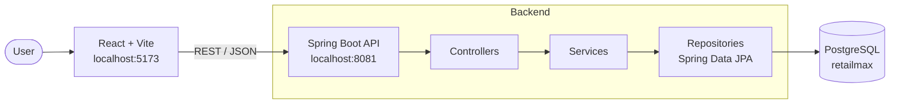
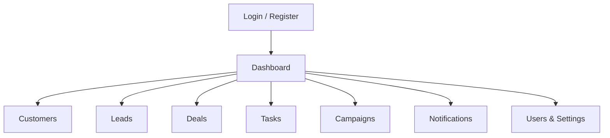
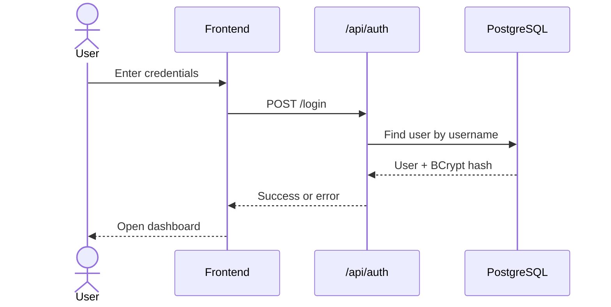
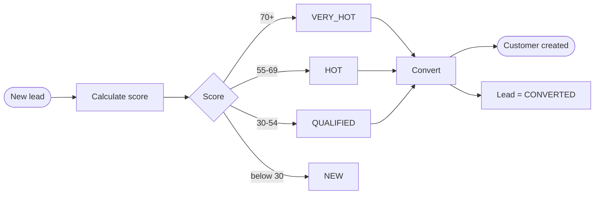
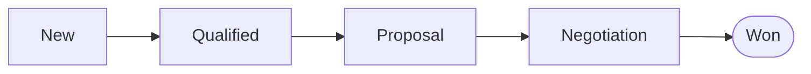
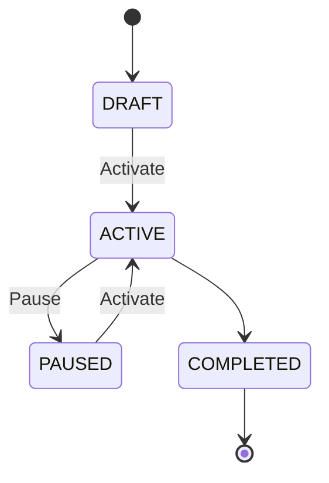
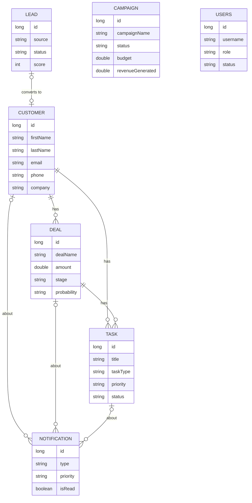

# RetailMax CRM

A full-stack CRM for retail teams: customers, leads, deals, tasks, campaigns and notifications in one workspace, with a sales pipeline dashboard.

**Stack:** React 19 + TypeScript (Vite) · Spring Boot 4.1 (Java 21) · PostgreSQL

## Architecture



## Modules



## Workflows

### Sign in



### Lead to customer



Score (max 80): email 20 · phone 20 · name 10 · source up to 30 (Referral 30, LinkedIn 25, Website 20, Social 15, other 10).

### Sales pipeline



### Campaign status



## Data model

Records are linked by ID columns (no database foreign keys).



## Getting started

**Prerequisites:** Java 21, Node.js 20+, PostgreSQL

```bash
git clone https://github.com/Ananyaaa171/RetailMax-CRM.git
cd RetailMax-CRM
```

**1. Database**

```sql
CREATE DATABASE retailmax;
```

Tables are created automatically on first run.

**2. Backend** (runs on `http://localhost:8081`)

Set your credentials in `backend/retailmax-backend/src/main/resources/application.properties`, or use environment variables:

```bash
export SPRING_DATASOURCE_USERNAME=postgres
export SPRING_DATASOURCE_PASSWORD=<your-password>

cd backend/retailmax-backend
./mvnw spring-boot:run
```

**3. Frontend** (runs on `http://localhost:5173`)

```bash
cd frontend
npm install
npm run dev
```

Register an account, then log in.

## API

Base path `/api`

| Resource | Endpoints |
|---|---|
| `/auth` | `POST /register` `POST /login` |
| `/dashboard` | `GET /summary` `/sales` `/leads` |
| `/customers` `/deals` | CRUD |
| `/leads` | CRUD, `POST /{id}/calculate-score`, `POST /{id}/convert` |
| `/tasks` | CRUD, `PUT /{id}/complete` |
| `/campaigns` | CRUD, `PUT /{id}/status`, `/{id}/performance` |
| `/notifications` | `GET`, `POST`, `PUT /{id}/read`, `/{id}/unread`, `DELETE` |
| `/users` | CRUD, `PUT /{id}/status` |

## Project structure

```
backend/retailmax-backend/src/main/java/retailmax_backend/
├── controller/   entity/   repository/   service/
frontend/src/
├── App.tsx   App.css   components/AuthPage.tsx
```

## Known limitations

- Roles are stored but not enforced; endpoints are not token-protected.
- API URL is hardcoded to `localhost:8081` in the frontend.

## Author

Ananya Sharma, ABES · Guide: Mr. Avinay